# Architecture

## Introduction and Goals

Quizzard of Oz is a web-based quiz platform for players who want either a
casual solo experience or a competitive multiplayer match with visible
progress. The system exists to combine accessible quiz gameplay, persistent
player identity and synchronized sessions in one product that is simple for
players to use and maintainable for the team to evolve.

### Requirements Overview

The most important functional requirements for the current system are:

1. The platform must support three quiz experiences: practice mode for solo
   play, unranked multiplayer sessions for casual competition and ranked
   multiplayer sessions with Elo updates.
2. Public users must be able to access core product pages such as the
   leaderboard, practice mode, unranked mode and session settings without
   requiring a login.
3. Registered users must have a persistent player identity that connects their
   profile, match history and ranked progression.
4. Ranked and profile-related features must be protected by authentication so
   only authorized users can access them.
5. Multiplayer sessions must stay synchronized across both players, including
   session state, question flow, scoring and round progression.
6. The backend must retrieve quiz questions from an external trivia provider
   and cache them locally to reduce latency and dependency on repeated live API
   calls.

### Quality Goals

| Priority | Quality Goal | Why It Matters | Concrete Expectation |
| --- | --- | --- | --- |
| 1 | Performance | Quiz rounds should feel immediate, especially in ranked and unranked matches where waiting breaks the game flow. | A player should receive the next question or round update without noticeable delay during an active session because the backend uses cached questions and lightweight APIs. |
| 2 | Security | Ranked progression, user profiles and future personal data must be protected from unauthorized access or manipulation. | Only authenticated users can access ranked-only capabilities and credentials are stored as password hashes while session access is controlled through tokens. |
| 3 | Maintainability | The project is developed in a course and team setting, so new contributors must understand and change the system without high onboarding cost. | Frontend, backend, persistence and documentation responsibilities stay clearly separated so a new developer can identify the relevant component quickly. |
| 4 | Reliability | A multiplayer match must behave consistently even when external services are slow or temporarily unavailable. | Running matches should continue without direct dependency on every external trivia request because question data is prepared from local cache whenever possible. |

### Stakeholders

| Role | Expectations | Architectural Interest |
| --- | --- | --- |
| Players | Want responsive quiz gameplay, fair ranked and unranked sessions and a clear user experience across public and authenticated features. | Low latency, reliable session handling, transparent ranking behavior and stable frontend interactions. |
| Development Team | Needs a codebase that is understandable, modular and realistic to extend during the project. | Clear separation of frontend, backend, persistence and external integrations; understandable documentation and interfaces. |
| Reviewers / Instructors | Need to understand the system quickly and evaluate technical decisions, quality and progress. | Traceable requirements, explicit architectural reasoning and documentation that reflects the implemented system. |

## Architecture Constraints

- The project is a web application with a separate frontend and backend.
- Ranked and unranked matches need synchronized gameplay behavior.
- Documentation is published through Sphinx on Read the Docs.
- The system uses an external trivia API, so caching and resilience matter.

## Context and Scope

### Business Context

The platform serves players who want either a casual quiz experience or a
competitive match with persistent ranking. Users interact with a web frontend,
which communicates with backend services responsible for authentication,
question sourcing, matchmaking and score tracking.

### Technical Context

- Frontend: Next.js application for the website and game flows
- Backend: Python service layer for APIs, matchmaking and business logic
- Database: Persistent storage for users, sessions, questions and leaderboard
- External integration: Trivia provider for question retrieval

## Solution Strategy

- Use a modern web frontend for the player-facing experience.
- Build the backend around explicit API contracts and cached question access.
- Model sessions and participants directly in the database so gameplay state is
  inspectable and durable.
- Separate concept documentation from architecture decisions to keep this page
  focused on system structure.

## Building Block View

### Whitebox Overall System

**Core building blocks**

- Frontend application for navigation, game flows and player-facing UI
- Backend application for auth, matchmaking, gameplay orchestration and scoring
- Persistence layer for users, sessions, questions and ranking data
- External trivia API used to populate and refresh the question cache

**Important interfaces**

- HTTP APIs between frontend and backend
- WebSocket-style real-time communication for synchronized matches
- Database access for gameplay and leaderboard state
- External API calls for new question data

## Runtime View

### Ranked and Unranked Session Flow

Both synchronized game modes share the same broad sequence:

1. Players enter a queue or session.
2. The backend creates or activates a session.
3. Questions are prepared from cached or newly fetched trivia data.
4. Players answer questions round by round.
5. The backend calculates scores and advances category selection.
6. Ranked mode additionally updates Elo after the match ends.

## Deployment View

### Infrastructure Level 1

- The frontend is deployed as a web application for players.
- The backend is deployed as an API service with access to persistent storage.
- Documentation is deployed separately through Read the Docs using Sphinx.

### Infrastructure Level 2

- Client browsers load the frontend and connect to backend APIs.
- Backend services persist state in the database and communicate with the
  external trivia provider when the cache needs replenishment.

## Cross-cutting Concepts

### Authentication

Authentication is handled with JWT-backed sessions and hashed passwords.

### Real-Time Communication

Ranked and unranked matches need near real-time event delivery so both players
see progress consistently.

### Question Caching

Question data is cached locally to reduce latency and avoid overusing the
external trivia API.

## Quality Requirements

### Quality Requirements Overview

- Responsive question delivery
- Stable synchronized sessions
- Maintainable separation of concerns
- Clear operational and architectural visibility

### Quality Scenarios

- A ranked match should progress without players waiting on repeated external
  question fetches during the session.
- New team members should be able to understand the main system components
  through this documentation alone.

## Risks and Technical Debts

- Real-time synchronization can become fragile if session state is not modeled
  clearly on the backend.
- External trivia API availability may impact gameplay without strong caching.
- Documentation still reflects an evolving product, so some sections remain
  directional rather than final.

## Glossary

| Term | Definition |
| --- | --- |
| Elo | Ranking value used to estimate player skill in ranked matches |
| Session | A single multiplayer match lifecycle |
| Question Cache | Local store of trivia questions fetched from the external provider |
